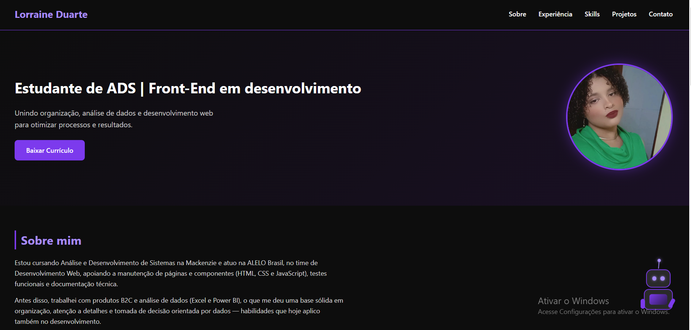

# 💜 Portfólio — Lorraine Duarte

Portfólio pessoal desenvolvido com React, criado para apresentar minha trajetória, projetos e habilidades na área de Front-End.

🔗 **[Ver portfólio ao vivo](https://portfolio-lorraine-zeta.vercel.app)**git add .



---

## 👩‍💻 Sobre o projeto

Estudante de Análise e Desenvolvimento de Sistemas, atuando no time de Desenvolvimento Web da ALELO Brasil. Este portfólio reúne minha trajetória — da análise de dados ao front-end — além dos projetos que venho desenvolvendo ao longo do caminho.

## 🛠️ Tecnologias utilizadas


## ✨ Funcionalidades

- Design responsivo (desktop, tablet e celular)
- Menu hambúrguer animado no modo mobile
- Efeito de digitação no título de apresentação
- Seção de projetos com mockups ilustrativos
- Botão de download do currículo em PDF
- Ícones de contato direto (e-mail, LinkedIn, GitHub, WhatsApp)
- Scroll suave entre seções

## 📂 Como rodar o projeto localmente

```bash
# Clone este repositório
git clone https://github.com/SEU-USUARIO/NOME-DO-REPOSITORIO.git

# Entre na pasta do projeto
cd NOME-DO-REPOSITORIO

# Instale as dependências
npm install

# Rode o projeto
npm run dev
```

## 📬 Contato

- LinkedIn: [linkedin.com/in/lorrrained](https://linkedin.com/in/lorrrained)
- E-mail: dlorrane05@gmail.com

---

Feito com 💜 por Lorraine Duarte